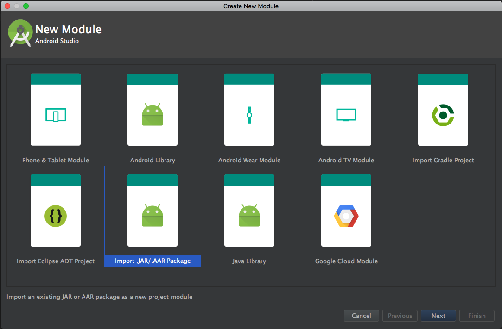
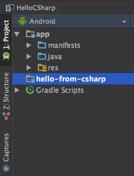
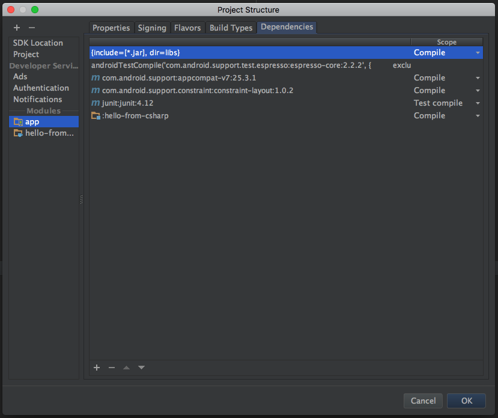
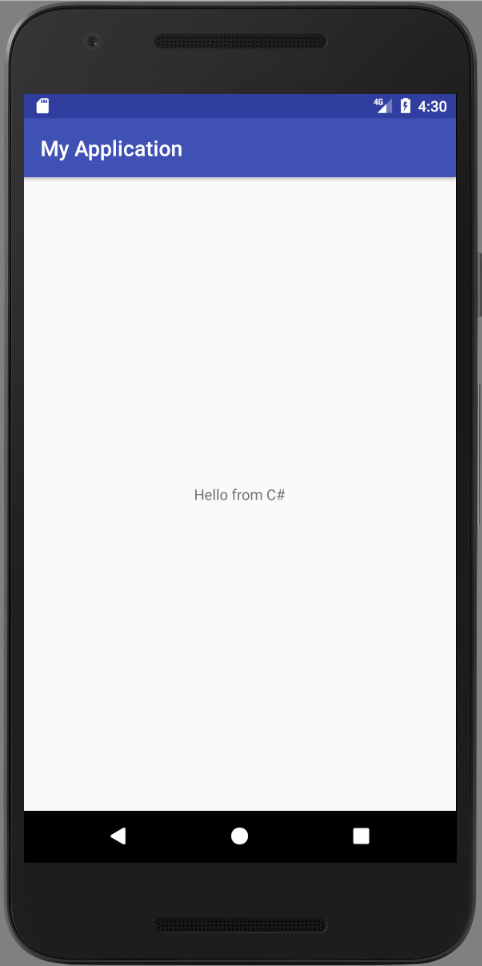

# Getting started with Android

In addition to the requirements from our [Getting started with Java](getting-started-java.md) guide you'll also need:

* Xamarin.Android 7.3.x or later
* Android Studio 2.3.2 or later

Open Visual Studio for Windows or Mac, create a new .NET Class Library project, name it `hello-from-csharp`, and save it to `~/Projects/hello-from-csharp` or `%USERPROFILE%\Projects\hello-from-csharp`.

Replace the code in the `MyClass.cs` file with the following snippet:

```csharp
public class Hello
{
	public string World ()
	{
		return "Hello from C#";
	}
}
```

Build the project, the resulting assembly will be saved as `$(ProjectDir)/bin/Debug/hello-from-csharp.dll`.

Follow the [previous guide](getting-started-java.md) for details, and clone the source of Embeddinator 4000 into an easy-to-find directory such as `~/Projects/Embeddinator-4000` and compile it.

Run the embeddinator to create a native AAR file for the managed assembly:

```shell
cd ~/Projects/Embeddinator-4000
mono ~/Projects/Embeddinator-4000/build/lib/Debug/MonoEmbeddinator4000.exe ~/Projects/hello-from-csharp/hello-from-csharp/bin/Debug/hello-from-csharp.dll --gen=Java --platform=Android --outdir=../hello-from-csharp/output -c
```

Or on Windows, navigate to the root of Embeddinator-4000 in cmd:
```
build\lib\Debug\MonoEmbeddinator4000.exe %USERPROFILE%\Projects\hello-from-csharp\hello-from-csharp\bin\Debug\hello-from-csharp.dll --gen=Java --platform=Android --outdir=../hello-from-csharp/output -c
```

The Android AAR file will be placed in `~/Projects/hello-from-csharp/output/hello_from_csharp.aar`. _NOTE: hyphens are replaced because Java does not support it in package names._

### Use the generated output in an Android Studio project

Open Android Studio and create a new project with an `Empty Activity`.

Right-click on your `app` module and choose `New | Module`. Select `Import .JAR/.AAR Package`. Use the directory browser to locate `~/Projects/hello-from-csharp/output/hello_from_csharp.aar` and hit `Finish`.



This will copy the AAR file into a new module named `hello_from_csharp`.



To use the new module from your `app`, right-click and choose `Open Module Settings`. On the `Dependencies` tab, add a new `Module Dependency` and choose `:hello_from_csharp`.



Open your main layout file `activity_main.xml`, and give the default `TextView` an `ID` of `text`.

In your activity, add the following line to your `onCreate` method:
```java
import hello_from_csharp_dll.Hello;

public class MainActivity extends AppCompatActivity {

    @Override
    protected void onCreate(Bundle savedInstanceState) {
        super.onCreate(savedInstanceState);
        setContentView(R.layout.activity_main);

        Hello hello = new Hello();
        TextView text = (TextView)findViewById(R.id.text);
        text.setText(hello.world());
    }
}
```

Upon launching your app:



## Current Limitations on Android

Right now your C# library can't have any access to Android APIs or `Mono.Android.dll`. Your assembly must be a plain .NET 4.5 class library. The current plan is to support Android Library Projects in the future.

## Further Reading

* [Preliminary Android Research](android-preliminary-research.md)
* [Embeddinator Limitations](Limitations.md)
* [Contributing to the open source project](Contributing.md)
* [Error codes and descriptions](errors.md)