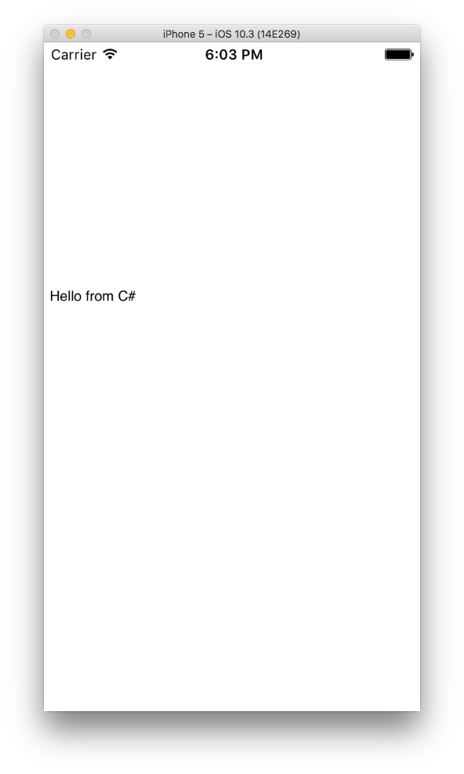

# Getting started with iOS

This is the getting started page for iOS.

*Working for tvOS or watchOS is very similar to iOS. You should start with the iOS instructions and then apply them to your platform of choice.*

## Requirements

In order to use the embeddinator to generate bindings for iOS you'll need a Mac running:

* macOS 10.12 (Sierra) or later
* Xcode 8.3.2 or later
* [Mono 5.0](http://www.mono-project.com/download/beta/) _presently in beta_ or later
* [Xamarin.iOS](https://jenkins.mono-project.com/view/Xamarin.MaciOS/job/xamarin-macios-builds-master/) from our _master_ branch.
* [Embeddinator-4000](https://jenkins.mono-project.com/view/Xamarin.MaciOS/job/embeddinator-4000-objc/lastSuccessfulBuild/Azure/).

Optionally you can install [Xamarin Studio](https://developer.xamarin.com/guides/cross-platform/xamarin-studio/)
or the new [Visual Studio for Mac](https://www.visualstudio.com/vs/visual-studio-mac/)
to edit and compile your C# code. The rest of the getting started
guide assume you'll be using **Visual Studio for Mac**.

Notes:

* Earlier versions of macOS, Xcode and Mono _might_ work, but are untested and unsupported;
* Code generation can be done on Windows, but it is only possible to compile it on a Mac computer where Xcode is installed;

## Hello world

First let's build a simple hello world example in C#.

### Create C# sample

Open Visual Studio for Mac, create a new iOS Class Library project, name it `hello-from-csharp`, and save it to `~/Projects/hello-from-csharp`.

Replace the code in the `MyClass.cs` file with the following snippet:

```csharp
using UIKit;
public class MyUIView : UITextView
{
	public MyUIView ()
	{
		Text = "Hello from C#";
	}
}
```

Build the project, the resulting assembly will be saved as `~/Projects/hello-from-csharp/hello-from-csharp/bin/Debug/hello-from-csharp.dll`.

### Bind the managed assembly

Run the embeddinator to create a native framework for the managed assembly:

```shell
cd ~/Projects/hello-from-csharp
/Library/Frameworks/Xamarin.Embeddinator-4000/Commands/objcgen ~/Projects/hello-from-csharp/hello-from-csharp/bin/Debug/hello-from-csharp.dll --target=framework --platform=iOS --outdir=output -c --debug
```

The framework will be placed in `~/Projects/hello-from-csharp/output/hello-from-csharp.framework`.

### Use the generated output in an Xcode project

Open Xcode and create a new iOS Single View Application, name it `hello-from-csharp`.

Open the `~/Projects/hello-from-csharp/output` directory in Finder, select `hello-from-csharp.framework`, drag it to the Xcode project and drop it just above the `hello-from-csharp` folder in the project.

Make sure `Copy items if needed` is checked in the dialog that pops up, and click `Finish`.

In the project's General tab, add `hello-from-csharp.framework` as an Embedded Binary.

Open ViewController.m, and replace the contents with:

```objective-c
#import "ViewController.h"
#include "hello-from-csharp/hello-from-csharp.h"

@interface ViewController ()
@end

@implementation ViewController
- (void)viewDidLoad {
    [super viewDidLoad];

    MyUIView *view = [[MyUIView alloc] init];
    view.frame = CGRectMake(0, 200, 200, 200);
    [self.view addSubview: view];
}
@end
```

Finally run the Xcode project, and something like this will show up:


