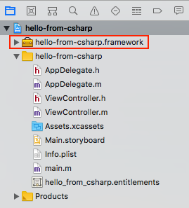
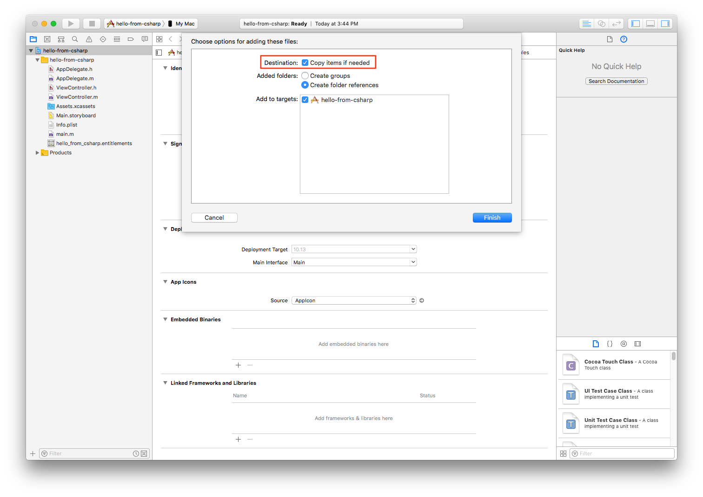
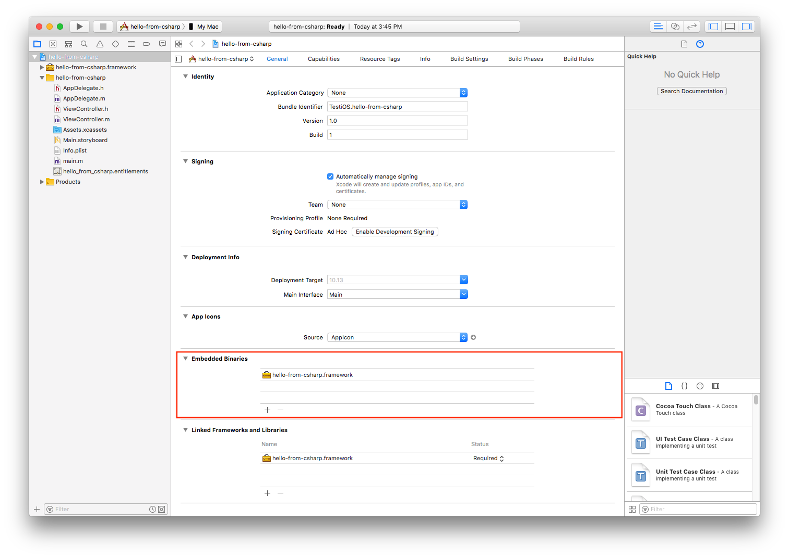
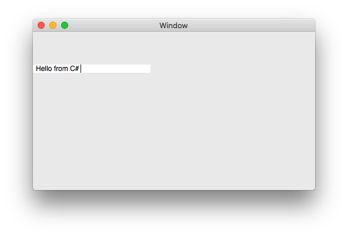

# Getting started with macOS and Embeddinator-4000

## What you will need

* Follow instructions in our [Getting started with Objective-C](getting-started-objective-c.md) guide.

## Hello world

First let's build a simple hello world example in C#.

### Create C# sample

Open Visual Studio for Mac, create a new Mac Class Library project, name it `hello-from-csharp`, and save it to `~/Projects/hello-from-csharp`.

Replace the code in the `MyClass.cs` file with the following snippet:

```csharp
using AppKit;
public class MyNSView : NSTextView
{
	public MyNSView ()
	{
		Value = "Hello from C#";
	}
}
```

Build the project, the resulting assembly will be saved as `~/Projects/hello-from-csharp/hello-from-csharp/bin/Debug/hello-from-csharp.dll`.

### Bind the managed assembly

Run the embeddinator to create a native framework for the managed assembly:

```shell
cd ~/Projects/hello-from-csharp
objcgen ~/Projects/hello-from-csharp/hello-from-csharp/bin/Debug/hello-from-csharp.dll --target=framework --platform=macOS-modern --abi=x86_64 --outdir=output -c --debug
```

The framework will be placed in `~/Projects/hello-from-csharp/output/hello-from-csharp.framework`.

### Use the generated output in an Xcode project

Open Xcode and create a new Cocoa Application, name it `hello-from-csharp` and select the **Objective-C** language.

Open the `~/Projects/hello-from-csharp/output` directory in Finder, select `hello-from-csharp.framework`, drag it to the Xcode project and drop it just above the `hello-from-csharp` folder in the project.



Make sure `Copy items if needed` is checked in the dialog that pops up, and click `Finish`.



Select the `hello-from-csharp` project and navigate to the `hello-from-csharp` target's **General tab**. In the **Embedded Binary** section, add `hello-from-csharp.framework`.



Open ViewController.m, and replace the contents with:

```objective-c
#import "ViewController.h"

#include "hello-from-csharp/hello-from-csharp.h"

@implementation ViewController

- (void)viewDidLoad {
    [super viewDidLoad];
    
    MyNSView *view = [[MyNSView alloc] init];
    view.frame = CGRectMake(0, 200, 200, 200);
    [self.view addSubview: view];
}

@end
```

Finally run the Xcode project, and something like this will show up:




A more complete and better looking sample is available [here](https://github.com/mono/Embeddinator-4000/tree/objc/samples/mac/weather).