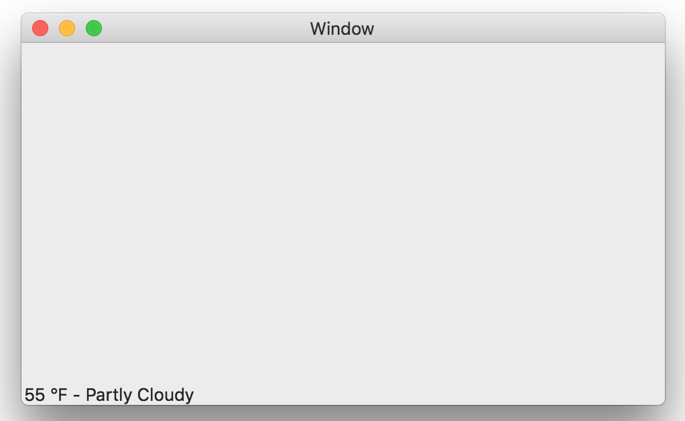

# Getting started with macOS and Embeddinator-4000

## What you will need

* Follow instructions in our [Getting started with Objective-C](getting-started-objective-c.md) guide.

* A .NET assembly to use with **Embeddinator-4000**.

* A macOS Cocoa Application

Please continue after you have followed the instructions in our [Getting started with Objective-C](getting-started-objective-c.md) guide. If you already have a .NET assembly you can skip directly into **Using Embeddinator-4000** section.

## Creating a .NET assembly

In order to build a .NET assembly you will need to open [Visual Studio for Mac](https://www.visualstudio.com/vs/visual-studio-mac/) and create a new **.NET Library Project** by doing *File > New Solution > Other > .NET > Library*. Click next and give *Weather* as the *Project Name*, and click on *Create*.

Follow the next steps:

1. Delete the **MyClass.cs** file and the **Properties** folder.

2. Right click on *Weather project > Add > New File.*

3. Select *Empty Class* and use **XAMWeatherFetcher** as the Name, then click New.

4. Replace the contents of *XAMWeatherFetcher.cs* with the following code:

```csharp
using System;
using System.Json;
using System.Net;

public class XAMWeatherFetcher {

	static string urlTemplate = @"https://query.yahooapis.com/v1/public/yql?q=select%20item.condition%20from%20weather.forecast%20where%20woeid%20in%20(select%20woeid%20from%20geo.places(1)%20where%20text%3D%22{0}%2C%20{1}%22)&format=json&env=store%3A%2F%2Fdatatables.org%2Falltableswithkeys";
	public string City { get; private set; }
	public string State { get; private set; }

	public XAMWeatherFetcher (string city, string state)
	{
		City = city;
		State = state;
	}

	public XAMWeatherResult GetWeather ()
	{
		try {
			using (var wc = new WebClient ()) {
				var url = string.Format (urlTemplate, City, State);
				var str = wc.DownloadString (url);
				var json = JsonValue.Parse (str)["query"]["results"]["channel"]["item"]["condition"];
				var result = new XAMWeatherResult (json["temp"], json["text"]);
				return result;
			}
		}
		catch (Exception ex) {
			// Log some of the exception messages
			Console.WriteLine (ex.Message);
			Console.WriteLine (ex.InnerException?.Message);
			Console.WriteLine (ex.InnerException?.InnerException?.Message);

			return null;
		}

	}
}

public class XAMWeatherResult {
	public string Temp { get; private set; }
	public string Text { get; private set; }

	public XAMWeatherResult (string temp, string text)
	{
		Temp = temp;
		Text = text;
	}
}
```

You will notice that `Using System.Json;` gives an error; in order to fix this we need to do the following:

1. Double click on the **References** folder.

2. Click on the **Packages** tab.

3. Check **System.Json**.

4. Click **Ok**.

Once the above is done all we need to do is build our .NET assembly by clicking on *Build menu > Build All* or ⌘ + b. Build Succesful message should appear in the top status bar.

Now right click on *Weather* project node and select *Reveal in Finder*. In Finder go to the *bin/Debug* folder; inside it you will find **Weather.dll.**

## Using Embeddinator-4000

If you installed Embeddinator-4000 using our pkg installer you should find **objcgen** in the following path `/Library/Frameworks/Xamarin.Embeddinator-4000.framework/Commands/objcgen`; **objcgen** is the tool that we need to generate a native library from a .NET assembly.

Open terminal, `cd` into the folder containing Weather.dll, and execute **objcgen** with the arguments shown below:

```shell
cd /Users/Alex/Projects/Weather/Weather/bin/Debug

/Library/Frameworks/Xamarin.Embeddinator-4000/Commands/objcgen --debug --outdir=output -c Weather.dll
```

Everything you need will be placed into the **output** directory next to *Weather.dll*. If you have your own .NET assembly, replace *Weather.dll* with it and follow the same steps above.

## Using the generated output in an Xcode project

Open Xcode and create a new **macOS Cocoa Application** and name it **MyWeather**. Right click on the *MyWeather project node*, select *Add Files to "MyWeather"*, navigate to the **output** directory created by *Embeddinator-4000*, and add the following files:

* bindings.h
* embeddinator.h
* glib.h
* mono-support.h
* mono_embeddinator.h
* objc-support.h
* libWeather.dylib
* Weather.dll 

Make sure **Copy items if needed** is checked in the options panel of the file dialog.

Now we need to make sure that **libWeather.dylib** and **Weather.dll** get into the app bundle:

* Click on *MyWeather project node*.
* Select *Build Phases* tab.
* Add a new *Copy Files Phase*.
* On *Destination* select **Frameworks** and add **libWeather.dylib**.
* Add a new *Copy Files Phase*.
* On *Destination* select **Executables**, add **Weather.dll** and make sure *Code Sign on Copy* is checked.

Now open **ViewController.m** and replace its contents with:

```objective-c
#import "ViewController.h"
#import "bindings.h"

@implementation ViewController

- (void)viewDidLoad {
	[super viewDidLoad];

	XAMWeatherFetcher * fetcher = [[XAMWeatherFetcher alloc] initWithCity:@"Boston" state:@"MA"];
	XAMWeatherResult * weather = [fetcher getWeather];
	
	NSString * result;
	if (weather)
		result = [NSString stringWithFormat:@"%@ °F - %@", weather.temp, weather.text];
	else
		result = @"An error occured";
	
	NSTextField * textField = [NSTextField labelWithString:result];
	[self.view addSubview:textField];
}

@end
```

Finally run the Xcode project, and something like this will show up:



A more complete and better looking sample is available [here](https://github.com/mono/Embeddinator-4000/tree/objc/samples/mac/weather).